# Jumping Stairs

[Download PDF](JumpingStairs.pdf) or [Download Keynote](JumpingStairs.key)

## Script

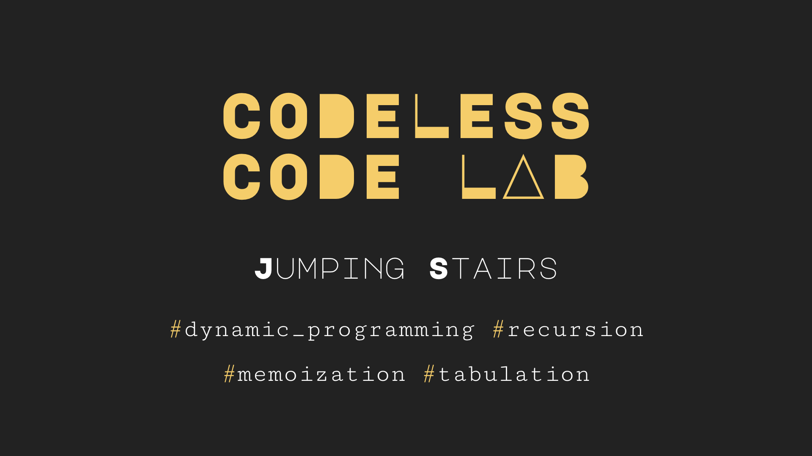

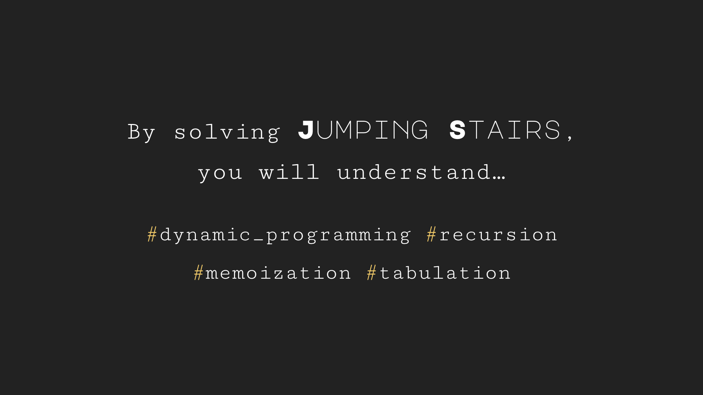

In this section of the codeless code lab, by solving the problem "Jumping Stairs," you will understand the concept of dynamic programming, recursion, memoization, and tabulation.

This video also has a Korean Version, linked in the description.

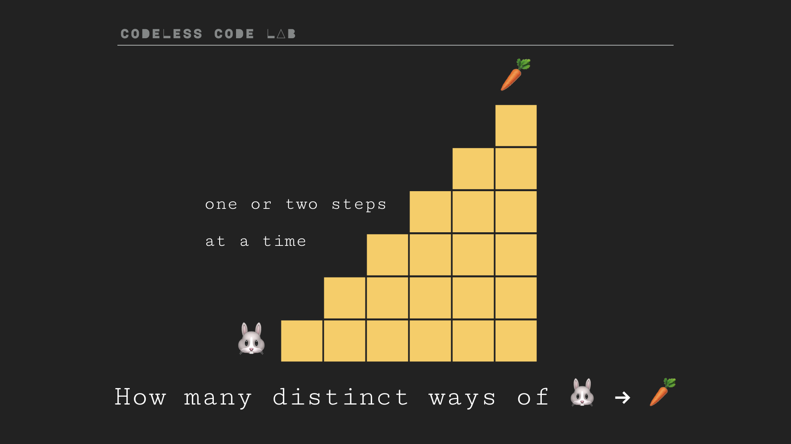

So let's explore the "Jumping stairs" problem. A rabbit is in front of a 6 step stair. On the top of the stair, there is a carrot. The rabbit wants to get the carrot. However, the rabbit can only jump one or two steps at a time. Rabbit can ask itself; how many distinct ways are there to climb the stairs and get the carrot?

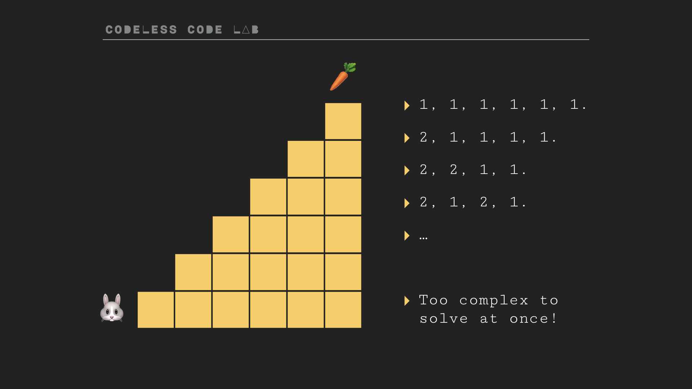

For example, the rabbit can jump 1 steps 6 times. Or maybe, it can jump two steps first and then jump 1 step 5 times. There are several combinations like this. This problem is too complex to solve at once, since we may forget to count some cases.

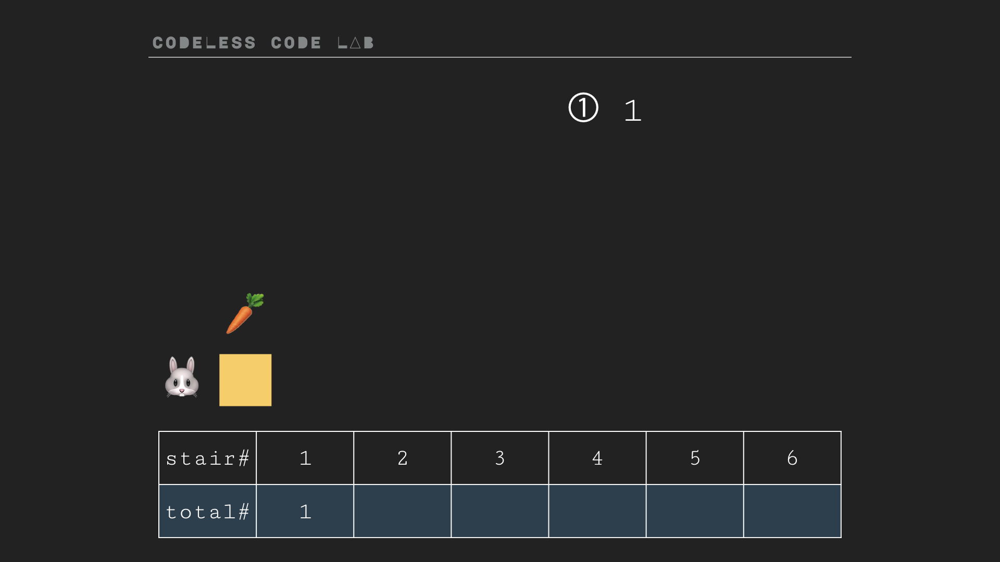

So, rather than jumping into a huge problem at first, let's water down the problem. Let's think of a smaller case. What about a staircase of 1 step? The answer would be "climb up 1 step." So the total combination number would be 1.

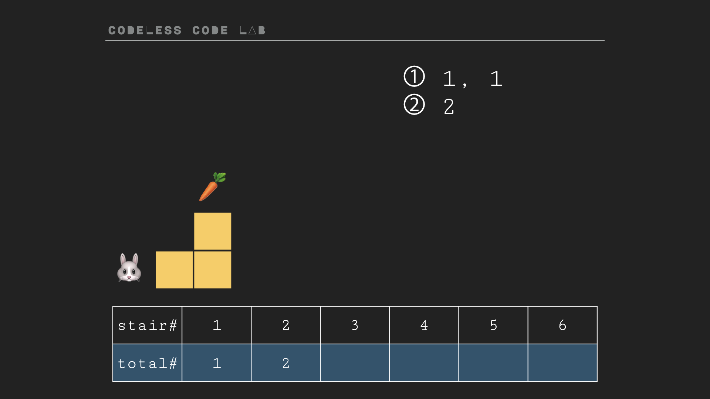

Now let's take a look at a staircase of 2 steps. The rabbit can jump one step twice, or jump two steps once. So the total combination number would be two.

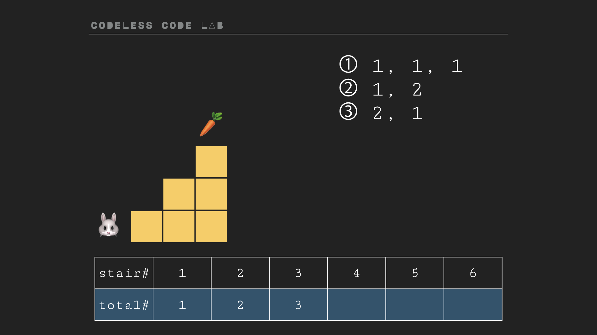

Staircase of 3 steps will be similar. Rabbit can jump 1 step 3 times, 1 step and then 2 steps, or reversed. The rabbit needs to climb three steps, so the steps of each jump should add up to three total steps. There are three distinct combinations of this.

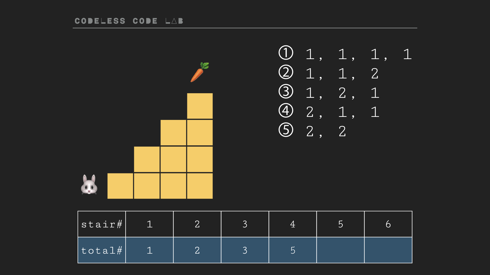

For a staircase with 4 steps, Rabbit can jump 1 step 4 times, two 1 step and then 2 steps rearranged, or two steps twice. Similarly, the steps of each jump should add up to four total steps. There are five distinct combinations of this.

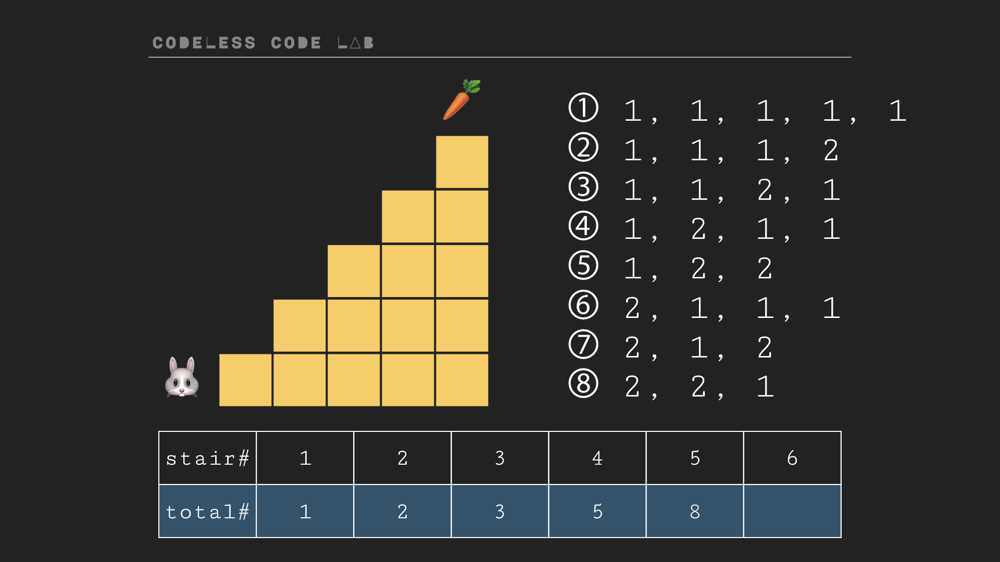

For a staircase with 5 steps, there are 8 combinations. Those who are curious with the combinations, please pause the video.
Now, you may find out some pattern.

1 plus 2 is 3. 2 plus 3 is 5 as well. 3 plus 5 is 8. This seems strange. Each staircase combination is an addition of two previous staircases. So, we can guess that the staircase of 6 will have 13 distinct ways of climbing the stairs, which is correct. Try to find all the combination of climbing the staircase of step 6. You will get the same answer.

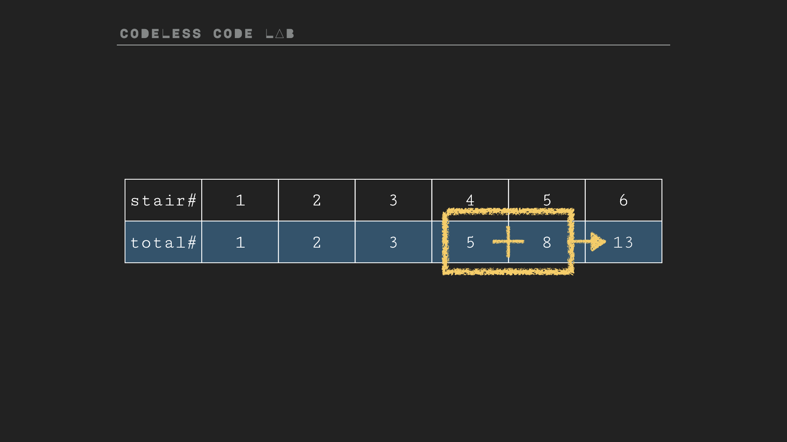

But why does this happen? To figure out, let's consider a staircase of 4 steps. Initially, the rabbit has two choices. It can jump up one step. I will call this choice 1. Alternatively, it can jump up two steps. I will call this choice 2. Since there is no other choice the rabbit can make at the beginning, we can say this. Staircase problem of step 4, Denoted as SP(4), is the addition of total case number from choice 1 and total case number of choice 2. We can say this because selecting choice 1 or 2 is mutually exclusive, but completely exhaustive. Two choices are distinct, but they include all the cases.

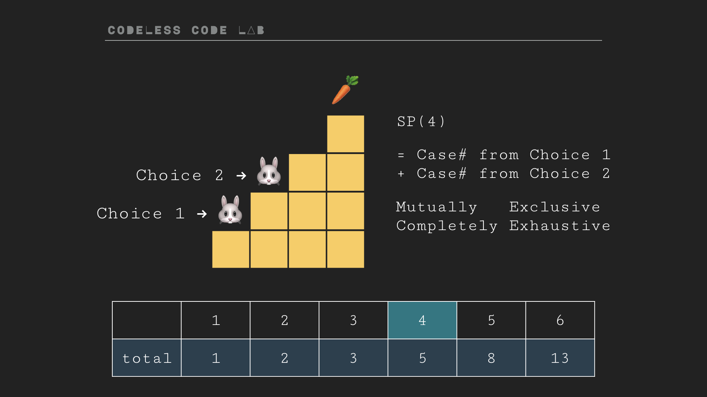

So let's explore the first choice. After climbing one step, the first floor is meaningless. So let's remove this part. Removing this part, you will see that the remaining problem is the same problem with finding the staircase problem with 3 steps. Also considering choice 2, let's ignore the previous two steps. Then you will figure that this is the same problem with the staircase problem with two steps. Just like this, we can generalize this to SP(N) is SP(N-1) plus SP(N-2), where N is a natural number bigger than 2. SP(N-1) is from choice 1, and SP(N-2) is from choice 2. Let's generalize this method to find the value of SP(N). Although there is a general solution for this SP(N), a Fibonacci sequence, for the sake of explaining the computer science concepts, let's explore this topic.

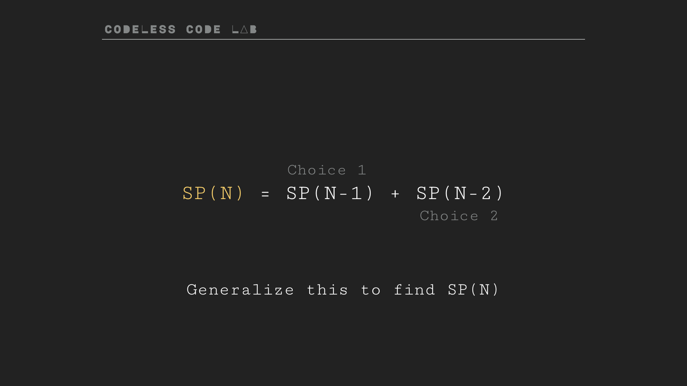

To find SP(N), we can approach from two sides. Top-down, and bottom-up. Let's explore the first method. 

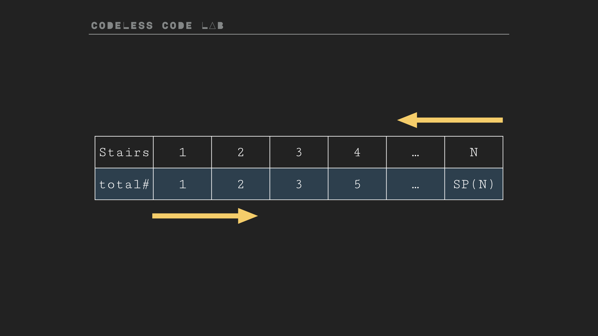

So going top to bottom means, we will figure out a value on demand. Like, to find SP(N), Find SP(N-1) and SP(N-2) and add those two. If the computer doesn't know the SP value? Then find it by repeating this same process. If the computer doesn't know the SP value again? Get one step deeper and find it again. Like this, we will find some value on demand. Of course, we need to keep N as a natural number, let's add a condition that SP(1) = 1 and SP(2) = 2.

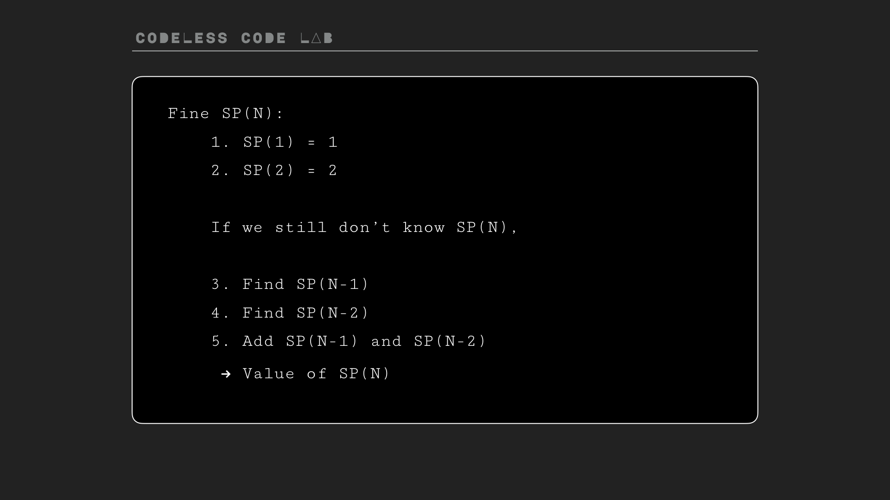

Let's write this down in traditional mathematical notation. SP(N) equals SP(N-1) plus SP(N-2), as previously seen. Since the computer both don't know the value of SP(N-1) and SP(N-2), it will repeat the same sequence, like this. SP(N-1) split into SP(N-2) and SP(N-3), and SP(N-2) to SP(N-3) and SP(N-4). Since the computer does not know these values as well, it repeats the same process.

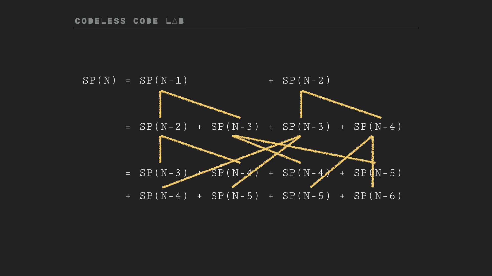

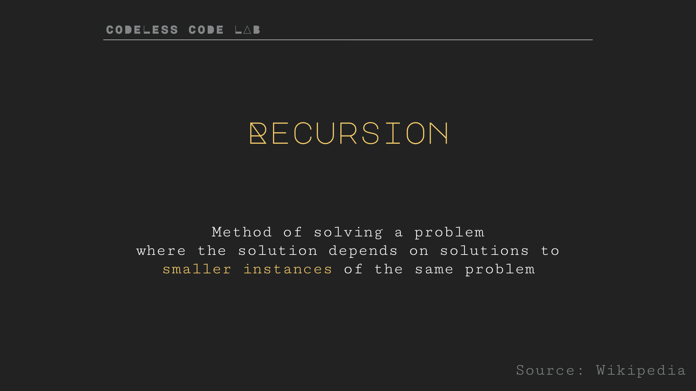

This method is called recursion. Recursion is a method of solving a problem, where the solution depends on solutions to smaller instances of the same problem. In this case, SP(N) is referring to smaller instances such as SP(N-1), SP(N-2), and so on.

However, there's a problem here. You see here, even though the computer already checked SP(N-3) here, the same operation is repeated afterward. This pattern is repeated on and on, so in the end, most of the calculations would be repeated. Not optimal.

So, how can we solve this? There is a quite commonly adopted solution for this. What would you do, if you need to repeat the same calculation? You take a note of that calculation result, and use that calculated result rather than calculating again and again. The same methodology is implemented in computer science as well. So a coder can say like this.

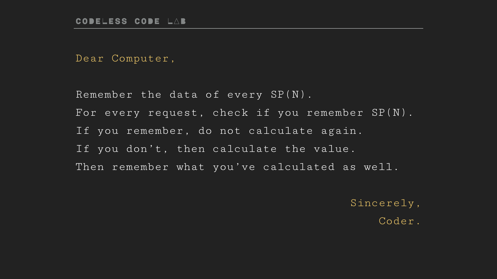

> Dear Computer,

> Remember the data of every SP(N).
> For every request, check if you remember SP(N).
> If you remember, do not calculate again.
> If you don’t, then calculate the value.
> Then remember what you’ve calculated as well.

> Sincerely,
> Coder.

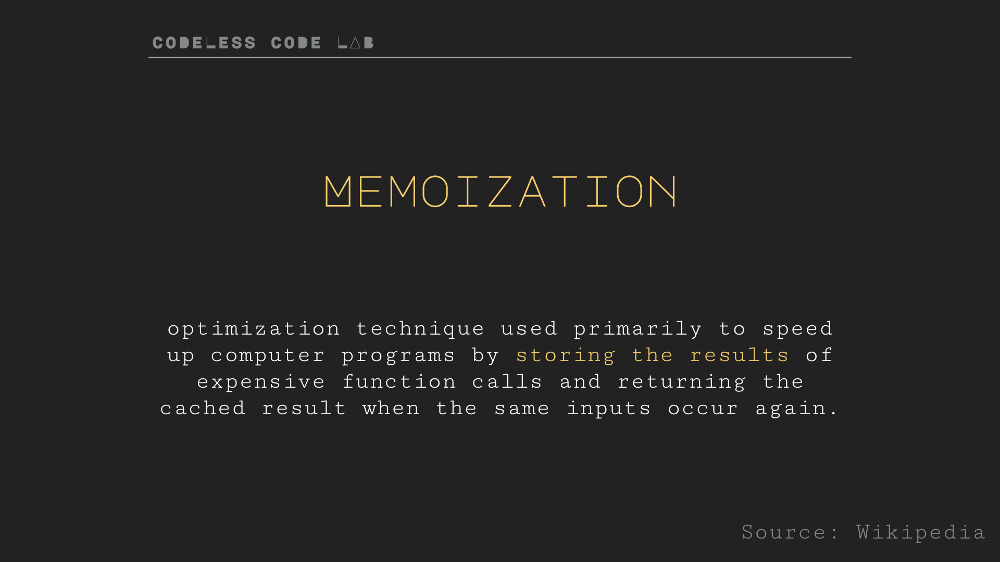

This is called the memoization. It is used to optimize recursion. It is an optimization technique used primarily to speed up computer programs by storing the results of expensive function calls (Which was the recursive function SP(N)) and returning the cached result when the same inputs occur again. This is often implemented with an array, list, map, dictionary, or whatever that is suitable for the situation. This will cost additional memory for the process to run.

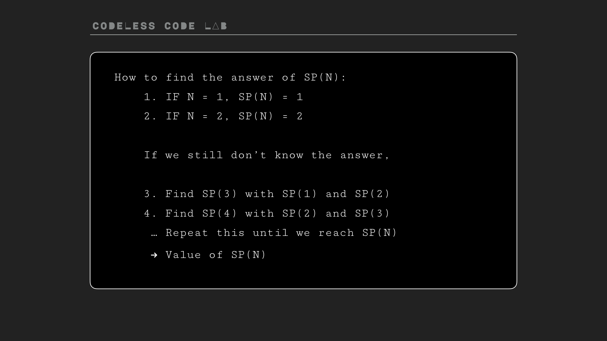

Now let's explore another way, the bottom-up method as well. This case, we will start from 1 and 2, we will increase the input until we reach N. So restating this as traditional mathematical notations, it would be like this. It starts from the bottom, and it climbs up to N. 

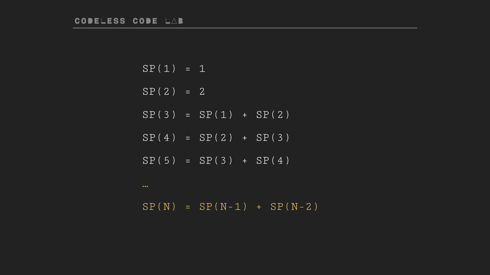

This method is called tabulation. Tabulation is a method of solving all related sub-problems first, in this case, is SP(1) to SP(N-1), typically by filling up the table. After the computer finds all the answer, based on the results in the table, the solution to the original problem is computed. There's no great need for memoization in this case since there is no heavy calculation repeated.

Each method has its pros and cons. Now, this table has several exceptions. It all depends on a programmer. If the programmer codes in an incredibly ingenious way, the results may vary. However, this is a trend, and most of the cases, it follows. So let's start from the recursion. It is relatively easy since we can say, "Hey computer, if you don't know the answer, just repeat this same process with different input." Tabulation needs to give every instruction to find the answer at once, so the initial code may seem a little more difficult. However, recursion might lose some speed, since recursion mostly depends on opening a new calculation. If opening a new recursion process itself is heavy, memoization would not change the situation drastically. Compared to that, the tabulation can generally be faster, since there is no more process opening. There are some occasions that recursion can be fast, but for a general problem, the tabulation can be faster.

When coming to solving a subproblem, Recursion may have a benefit. For some types of recursion, you don't need to calculate the entire problem to get a result of a subproblem; you only need to calculate partially. In these cases, recursion may be a better choice.
However, the tabulation can be better at solving the entire problem at once. Recursion will take more time to solve the entire problem generally, as previously mentioned.

And finally, for filling up the subproblem table, recursion can fill them on demand, but tabulation fills the table at once. 

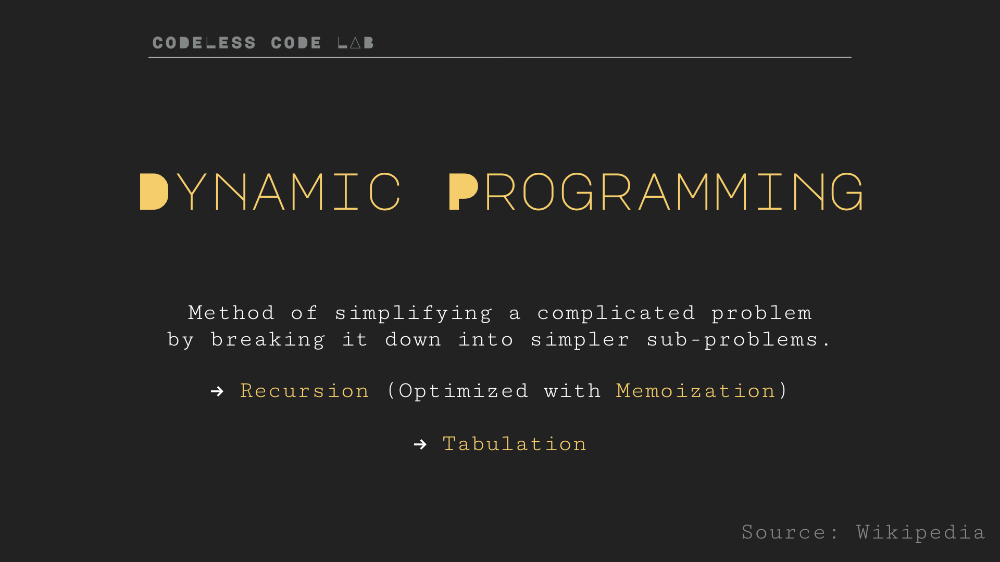

These are all types of dynamic programming. Dynamic programming is a method of simplifying a complicated problem by breaking it down into simpler sub-problems. We have explored two of them. Recursion often optimized with memoization and tabulation.

So, I hope you all learned something useful. This was Sunghyun Cho, from codeless code lab. Resources and credits are written in the description. Special thanks to Mr. Park, Yong Sung, for providing the initial idea where I could've started.

## Sources

* Wikipedia
* Geeksforgeeks
* Stackoverflow
* My brain for the most part

## Fonts used
* Major Mono Display
* Cutive Mono
* Apple Emoji
* Kakao Font

